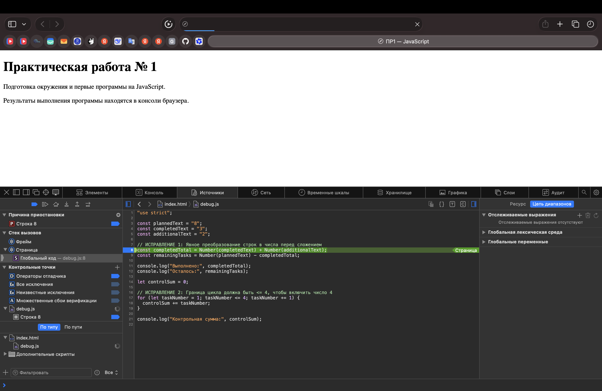

# Отчёт по Практической работе № 1

## Автор и вариант
- **Имя:** Артем Ильиных
- **Группа:** ЭФБО-05-25
- **Вариант:** 1 (totalTasks=12, completedTasks=5, dailyLimit=3)

## Окружение
- **Операционная система:** macOS
- **Node.js:** v26.8.2
- **npm:** 11.19.1
- **Git:** 2.39.5
- **Браузер:** Safari / Chrome

## Запуск
Команды выполняются из корня репозитория `tip-js-practices`:

### Node.js
node practice-01/js/hello.js
node practice-01/js/types.js
node practice-01/js/progress.js
node practice-01/js/plan.js
node practice-01/js/debug.js

### Браузер
Открыть `practice-01/index.html`, изменить путь в теге script, сохранить, открыть DevTools (Cmd+Option+I) → вкладка Console.

---

## Задание 1. Две среды выполнения
В браузере `typeof document` возвращает `"object"`, так как браузер предоставляет DOM API. В Node.js возвращает `"undefined"`, так как это серверная среда без DOM.

---

## Задание 2. Таблица типов и преобразований

| Выражение | Ожидание | Факт | Тип | Объяснение |
| :--- | :--- | :--- | :--- | :--- |
| "8" + 2 | "82" | "82" | string | Оператор + со строкой делает конкатенацию |
| "8" - 2 | 6 | 6 | number | Оператор - неявно преобразует строку в число |
| Number("8") + 2 | 10 | 10 | number | Явное преобразование, затем сложение |
| "12" > "3" | false | false | boolean | Строки сравниваются по кодам Unicode |
| 12 === "12" | false | false | boolean | Строгое равенство проверяет тип |
| Number("") | 0 | 0 | number | Пустая строка даёт 0 |
| Number("text") | NaN | NaN | number | Непреобразуемая строка даёт NaN |
| Boolean("false") | true | true | boolean | Непустая строка всегда true |
| typeof null | "object" | "object" | string | Историческая особенность JS |
| typeof NaN | "number" | "number" | string | NaN — специальное числовое значение |

---

## Задания 3 и 4. Проверки

### Задание 3 (progress.js)
| Проверка | Входные данные | Ожидаемый результат | Факт | Итог |
| :--- | :--- | :--- | :--- | :--- |
| Вариант 1 | 12, 5 | Осталось 7; 41.7%; В работе | Совпадает | Пройдено |
| 0 задач | 0, 0 | Задач пока нет | Совпадает | Пройдено |
| Не начато | 5, 0 | 0.0%; Не начато | Совпадает | Пройдено |
| Строка | "5", 2 | Ошибка | Совпадает | Пройдено |
| Превышение | 5, 6 | Ошибка | Совпадает | Пройдено |

### Задание 4 (plan.js)
| Проверка | Входные данные | Ожидаемый результат | Факт | Итог |
| :--- | :--- | :--- | :--- | :--- |
| Вариант 1 | 12, 5, 3 | 3 дня (3,3,1) | Совпадает | Пройдено |
| Готово | 5, 5, 2 | 0 дней | Совпадает | Пройдено |
| Лимит 0 | 5, 2, 0 | Ошибка | Совпадает | Пройдено |
| Лимит строка | 5, 2, "2" | Ошибка | Совпадает | Пройдено |

---

## Задание 5. Отладка

### Исходный вывод (с ошибками):
Выполнено: 32, Осталось: -24, Контрольная сумма: 6

### Таблица исправлений:
| Ошибка | Наблюдалось | Причина | Исправление | Результат |
| :--- | :--- | :--- | :--- | :--- |
| Сложение строк | 32 и -24 | Строки "3" и "2" склеились | Добавлено Number() | 5 и 3 |
| Граница цикла | Сумма 6 | Условие < 4 не включало 4 | Изменено на <= 4 | Сумма 10 |

### Скриншот отладки:

---

## Вывод
Освоены типы данных, строгое сравнение, преобразование типов и циклы while. Самая показательная ошибка — в Задании 5, где конкатенация строк дала неверный результат, легко найденный через точки останова в DevTools.
